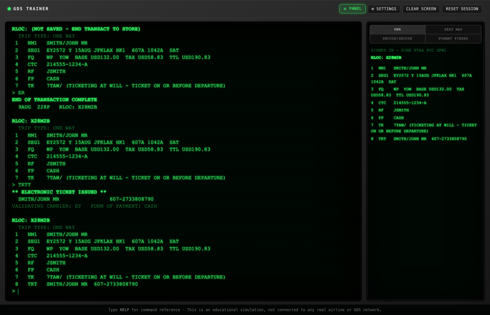

<p align="center">
  
</p>

# GDS Trainer

[](https://github.com/mattkup1/GDS-Simulator/actions/workflows/tests.yml)
[](LICENSE)

A green-phosphor CRT terminal simulator for learning classic GDS (Global
Distribution System) entry mnemonics — sign-in, availability, sell, PNR
build, pricing, ticketing, and end transaction — the way travel agents
actually type them. Built independently of, and not affiliated with, any
real GDS vendor. All flight, fare, and availability data is synthetic,
generated by a seeded PRNG. There are no network calls, no external
dependencies, and no real airline data anywhere in this project.

<p align="center">
  
</p>

Two editions share one rules core, so what you learn in either is identical:

- **Browser edition** (`web/`) — plain HTML/CSS/JS, no build step. Open
  `web/index.html` directly in a browser.
- **CLI edition** (`gds-trainer-cli/`) — a Python REPL with the same command
  set, for practicing in a terminal.

## Quick start

**Browser edition** — no install required:

```bash
open web/index.html   # macOS; on Linux/Windows just open the file in a browser
```

**CLI edition:**

```bash
cd gds-trainer-cli
python3 -m venv .venv
source .venv/bin/activate
pip install -e .
gds-trainer
```

In either edition, type `SI` to sign in, then `HELP` for the full command
reference.

## Learning resources

- [`docs/HOW-TO-BOOK-A-FLIGHT.md`](docs/HOW-TO-BOOK-A-FLIGHT.md) — a
  step-by-step walkthrough of booking a full itinerary from sign-in through
  ticketing.
- [`docs/GDS-TRAINER-BOOKING-GUIDE.pdf`](docs/GDS-TRAINER-BOOKING-GUIDE.pdf) —
  the same walkthrough as a printable guide.
- [`docs/TRAINING-SCENARIOS.pdf`](docs/TRAINING-SCENARIOS.pdf) — practice
  scenarios to work through once you know the basics.
- [`quiz/index.html`](quiz/index.html) — a standalone command-recall quiz in
  the same terminal styling. Open it directly in a browser.

## Repository layout

```
web/                the browser edition (index.html, style.css, script.js)
gds-trainer-cli/     the Python CLI edition
spec/                shared rules core both editions read from (grammar,
                      reference data, airport data, PNR-completeness rules)
docs/                user-facing guides and printable references
quiz/                standalone command-recall quiz
tests/               cross-edition test suite (runs against both editions)
```

Both editions are driven by the same command grammar and reference data in
`spec/`, so behavior can't drift between them — see `spec/README.md`.

## Testing

```bash
cd gds-trainer-cli && pip install -e ".[dev]"   # once, pulls in pytest
source gds-trainer-cli/.venv/bin/activate
pytest                                          # everything, from repo root
```

See [`tests/README.md`](tests/README.md) for how the suite is split between
fast CLI-only unit tests and the shared cross-edition scenario suite (which
drives the browser edition over a real headless Chrome). CI runs the full
suite on every push and pull request against `main`.

## Contributing

See [`CONTRIBUTING.md`](CONTRIBUTING.md) for how the two editions and the
shared `spec/` core fit together, and what a PR needs before it's mergeable.
[`CHANGELOG.md`](CHANGELOG.md) tracks notable changes release over release.

## License

MIT — see [LICENSE](LICENSE). Note that `spec/airline-logos/` (if populated
locally) contains real, trademarked third-party airline logos that are
**not** covered by this license and are gitignored rather than distributed —
see `spec/airline-logos/README.md`.
